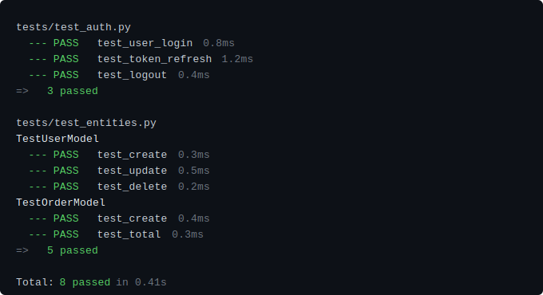
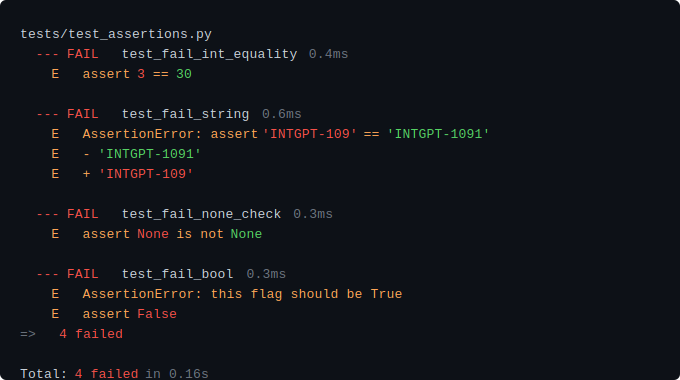
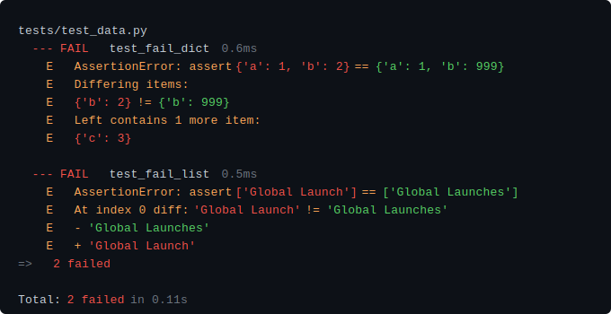
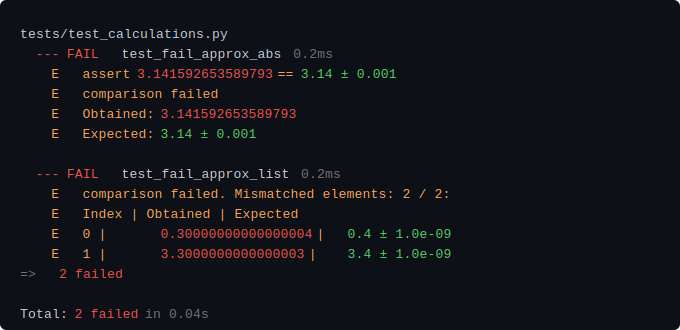
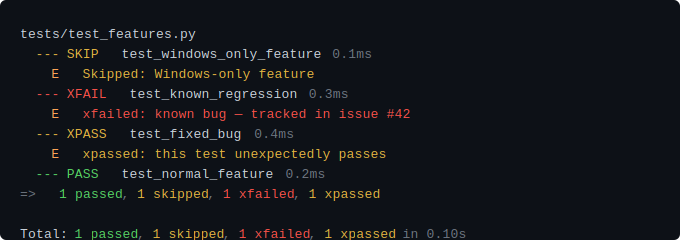
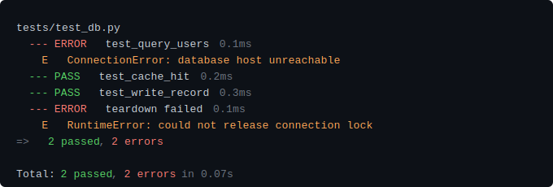
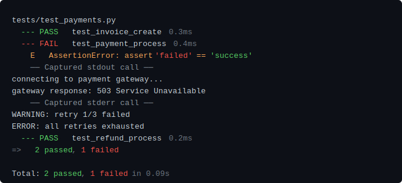
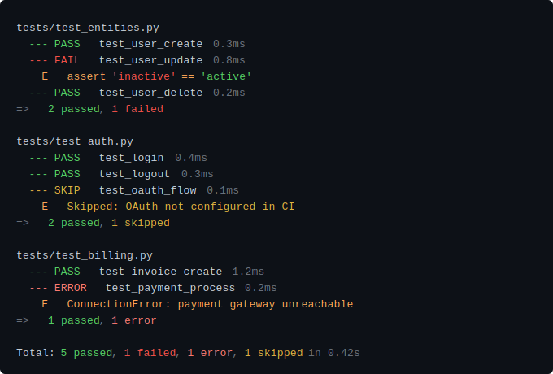
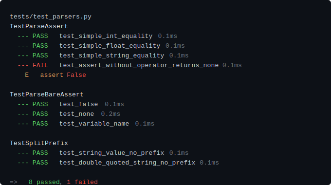

<div align="center">

# 🏺 pytest-glaze

### A thin, transparent coat that makes your test output shine.

[](...)
[](https://pypi.org/project/pytest-glaze/)
[](https://pypi.org/project/pytest-glaze/)
[](https://docs.pytest.org/)
[](LICENSE)
[](https://github.com/mikejmz24/pytest-glaze)

<br/>


</div>

---

pytest-glaze is an **opt-in** pytest output formatter. Pass `--glaze` to
activate a compact, color-semantic display. Failures surface inline — no
scrolling to a deferred block — and every color carries a consistent
meaning across every line type.

**Get started in 30 seconds:**

```bash
pip install pytest-glaze   # or: uv add pytest-glaze
pytest --glaze tests/
```

No configuration required. The `--glaze` flag activates the formatter
and silences the default reporter in one step.

---

## Why pytest-glaze?

The default pytest reporter is designed for completeness.
pytest-glaze is designed for **reading speed**.
When you are deep in a debugging session the question is always the same:
_what failed, and what exactly was wrong?_

|                               | Default reporter | pytest-rich / pytest-pretty | **pytest-glaze** |
| ----------------------------- | :--------------: | :-------------------------: | :--------------: |
| Failures inline               | ✗ deferred block |           Partial           |        ✓         |
| Consistent color semantics    |        ✗         |           Partial           |        ✓         |
| Zero extra dependencies       |        ✓         |       ✗ Rich required       |        ✓         |
| Compact — one line per result |        ✗         |              ✗              |        ✓         |
| Per-file summaries            |        ✗         |              ✗              |        ✓         |
| BDD-aware (pytest-bdd)        |        ✗         |              ✗              |        ✓         |

<br/>

### Color convention

Every color carries one meaning, applied consistently across every line type:

| Badge | Color        | Meaning                                     | Where you see it                                                         |
| :---: | ------------ | ------------------------------------------- | ------------------------------------------------------------------------ |
|  🟢   | Bright green | Received ✓ / expected value                 | PASS badge, `---`, assert right side, `-` diff, `Expected:` label        |
|  🔴   | Bright red   | Received ✗ / wrong value / expected failure | FAIL · XFAIL badge, `---`, assert left side, `+` diff, `Obtained:` label |
|  🟡   | Yellow       | Skipped / unexpected pass                   | SKIP · XPASS badge, `---`, skip reason                                   |
|  🔴   | Standard red | Collection / setup errors                   | ERROR badge, `---`, collection error messages                            |
|  🍑   | Soft peach   | Context / prose                             | Exception messages, diff context, `E` prefix, operator keywords          |
|  🔅   | Dim          | Metadata                                    | Duration, collection count, `Total:` line                                |

> **Diff convention:** pytest-glaze follows pytest's assertion semantics,
> not git diff convention. `-` marks the **expected** value (green — the
> target your test asserts). `+` marks the **received** value (red — what
> your code actually produced). This is the inverse of git, where `-` means
> removed and `+` means added.

---

## Installation

```bash
pip install pytest-glaze      # standard / venv
pip3 install pytest-glaze     # macOS system Python
uv add pytest-glaze           # uv projects
poetry add pytest-glaze       # poetry projects
```

pytest-glaze registers itself via pytest's plugin system automatically —
no `conftest.py` entry or `pytest_plugins` declaration needed.
Activate it per-run with the `--glaze` flag.

### Requirements

- **Python** ≥ 3.10
- **pytest** ≥ 7.0

---

## Usage

### Opt-in via `--glaze`

pytest-glaze is auto-registered by pytest on install but **opt-in by
default** — it activates only when you pass `--glaze`:

```bash
pytest --glaze tests/
```

This means existing CI pipelines and teammates who haven't installed the
package are unaffected. The default reporter runs unchanged until you
explicitly pass the flag.

### Always-on via `pyproject.toml`

To activate glaze for every run without passing `--glaze` each time, add
it to your pytest configuration:

```toml
# pyproject.toml
[tool.pytest.ini_options]
addopts = "--glaze"
```

Or in `pytest.ini`:

```ini
[pytest]
addopts = --glaze
```

### Makefile (strongly recommended)

A Makefile gives you precise control: glaze on by default, raw output
available when you need to debug the formatter itself. This is the
recommended setup for any project with a regular test workflow.

```makefile
PYTEST := uv run pytest          # or: python -m pytest
TESTS  := tests/

# Core formatter flags.
# --glaze activates pytest-glaze and silences the default reporter.
FMT := --glaze

# Optional pass-through filters
SUITE ?=
CASE  ?=
K     ?=
ARGS  ?=

_PATH  := $(if $(SUITE),$(SUITE),$(TESTS))
_KFLAG := $(if $(K),-k "$(K)",$(if $(CASE),-k "$(CASE)",))

.PHONY: test test-fast test-unit test-raw

## test        Run suite with glaze output.
##             SUITE=, CASE=, K= for filtering. ARGS= for raw pytest flags.
##             Examples:
##               make test
##               make test SUITE=tests/test_entities.py
##               make test CASE=test_return_statuses_dict
##               make test K="sprint and not slow"
# PYTHONPATH=. is only needed for editable/development installs where
# pytest_glaze is not yet on sys.path. Remove it if using pip install.
test:
	@PYTHONPATH=. $(PYTEST) $(FMT) $(_PATH) $(_KFLAG) $(ARGS)

## test-fast   Stop on first failure (-x). Accepts same filters as `test`.
test-fast:
	@PYTHONPATH=. $(PYTEST) $(FMT) -x $(_PATH) $(_KFLAG) $(ARGS)

## test-unit   Unit tests only — clean pass/fail signal, no intentional failures.
test-unit:
	@PYTHONPATH=. $(PYTEST) $(FMT) tests/test_parsers.py tests/test_colorizer.py tests/test_plugin.py $(_KFLAG) $(ARGS)

## test-raw    Raw default pytest output. Useful for debugging the formatter.
test-raw:
	@$(PYTEST) $(_PATH) $(_KFLAG) $(ARGS)

## help        List all targets.
help:
	@grep -E '^##' Makefile | sed 's/^## /  /'
```

### Skip glaze for a single run

Omit `--glaze` to use the default reporter. If you have `--glaze` in
`pytest.ini` or `pyproject.toml` and need to override it:

```bash
pytest -p no:pytest_glaze tests/
```

### Disabling color

pytest-glaze respects the [`NO_COLOR`](https://no-color.org/) convention.
Set `NO_COLOR=1` to suppress all ANSI color output — useful for CI
environments, plain-text log consumers, and accessibility needs:

```bash
NO_COLOR=1 pytest --glaze tests/
```

Color is also suppressed automatically when stdout is not a TTY (e.g.
when piping output to a file or another command):

```bash
pytest --glaze tests/ > results.txt
```

No configuration required for either case — pytest-glaze detects both
conditions at startup.

---

## What it formats

<details>
<summary><strong>Passing tests</strong></summary>



Passing tests render as compact single lines — one line per test, grouped by file and class.
No noise, no clutter. Pure green signal.

</details>

<details>
<summary><strong>Failing assertions — inline, never deferred</strong></summary>



Assertion failures render immediately below the failing test — no scrolling to a
separate deferred block. Received values are red, expected values are green,
prose context stays soft peach.

</details>

<details>
<summary><strong>Dict and list diffs</strong></summary>



Received values render in red, expected values in green. Diff markers (`-` expected, `+` received)
follow the same color convention. Prose context lines stay soft peach so the values stand out.

</details>

<details>
<summary><strong>Approximate equality (pytest.approx)</strong></summary>



`Obtained` renders in red — the wrong value. `Expected` renders in green — the target.
Table column alignment is preserved so list and dict comparisons stay readable.

</details>

<details>
<summary><strong>Skips, xfail, and xpass</strong></summary>



XFAIL renders in bright red — an expected failure is still a red signal
worth tracking. XPASS renders in yellow — an unexpected pass is a surprise
worth investigating, but not an error.

</details>

<details>
<summary><strong>Fixture errors</strong></summary>



Setup and teardown errors are classified separately from test failures.
A passing test body followed by a teardown ERROR both appear — neither is
silently swallowed.

</details>

<details>
<summary><strong>Captured output (shown only on failures)</strong></summary>



Captured output sections are suppressed on passing tests and rendered
inline on failures — no separate output block to hunt for.

</details>

<details>
<summary><strong>Per-file summaries</strong></summary>



Each file group closes with a `=> N passed, N failed` summary line.
Gives instant orientation in multi-file runs without reading every result.

</details>

<details>
<summary><strong>Class-based test grouping</strong></summary>



Class names render as section headers. Method names render without the class prefix.
Non-class tests render as before — no header, just the test name.

</details>

## BDD support (pytest-bdd)

pytest-glaze has first-class support for [pytest-bdd](https://pytest-bdd.readthedocs.io/).
Install pytest-bdd alongside pytest-glaze and BDD scenarios render with
Feature/Scenario headers, per-step results, and the same color semantics
as regular tests.

### Requirements

```bash
pip install pytest-bdd      # standard / venv
pip3 install pytest-bdd     # macOS system Python
uv add pytest-bdd           # uv projects
poetry add pytest-bdd       # poetry projects
```

### Compact mode (default)

By default pytest-glaze renders BDD scenarios in compact mode — one line
per scenario. Failures and errors always show full step-by-step output so
you can see exactly where things went wrong.


### Full step-by-step mode (`--bdd-steps`)

Pass `--bdd-steps` to see every step for every scenario:

```bash
pytest --glaze --bdd-steps tests/bdd/
```


### Supported scenario types

pytest-glaze handles every pytest-bdd scenario type:

| Type                              | Rendering                                                 |
| --------------------------------- | --------------------------------------------------------- |
| All steps pass                    | Compact PASS line (default) or full steps (`--bdd-steps`) |
| Failing assertion in Then         | Full steps with colored `assert X == Y` E line            |
| Non-assertion error in When       | Full steps with `ExceptionType: message` E line           |
| Error in Given (setup crash)      | ERROR on the Given step                                   |
| Step not found                    | ERROR on the missing step, trimmed message                |
| Skipped (`@pytest.mark.skip`)     | `--- SKIP  Scenario: …` with reason                       |
| Skipped via Gherkin tag (`@skip`) | Same as above via `pytest_bdd_apply_tag`                  |
| Xfail                             | Last step gets `--- XFAIL` badge                          |
| Xpass                             | Last step gets `--- XPASS` badge                          |
| Background steps                  | Dim `Background:` label before first background step      |
| Scenario Outline                  | One compact/full line per example row                     |
| Multiple example tables           | Each table's rows rendered independently                  |
| Docstring arguments               | Transparent — steps render normally                       |
| Datatable arguments               | Transparent — steps render normally                       |
| Teardown failure                  | `--- ERROR  teardown failed` after the scenario line      |
| Unicode scenario/step names       | Fully supported                                           |
| Tagged scenarios                  | Tags applied as pytest marks, rendering unaffected        |
| Rule blocks                       | Scenarios inside Rules render identically                 |
| Shared steps (conftest)           | Transparent — steps render normally                       |
| Wildcard `*` keyword              | Rendered as continuation step                             |
| Generic `@step` decorator         | Rendered identically to `@given/@when/@then`              |

### Makefile targets for BDD

```makefile
BDD_TESTS := tests/bdd/

FILE     ?=   # scope to a single file:  make test-bdd FILE=test_checkout
SCENARIO ?=   # scope to a scenario:     make test-bdd SCENARIO="Guest completes a purchase"

_BDD_PATH  := $(if $(FILE),tests/bdd/$(FILE).py,$(BDD_TESTS))
_BDD_KFLAG := $(if $(SCENARIO),-k "$(SCENARIO)",)

## test-bdd          Compact BDD output (default).
test-bdd:
	@PYTHONPATH=. $(PYTEST) $(FMT) $(_BDD_PATH) $(_BDD_KFLAG) $(ARGS)

## test-bdd-steps    Full step-by-step BDD output.
test-bdd-steps:
	@PYTHONPATH=. $(PYTEST) $(FMT) --bdd-steps $(_BDD_PATH) $(_BDD_KFLAG) $(ARGS)

## test-bdd-gherkin  Native pytest-bdd Gherkin terminal reporter (-v).
test-bdd-gherkin:
	@PYTHONPATH=. $(PYTEST) --gherkin-terminal-reporter -v $(_BDD_PATH) $(_BDD_KFLAG) $(ARGS)
```

---

## Noise suppression

pytest-glaze automatically suppresses lines that add no value in compact
output — before any line is rendered:

- `Omitting N identical items, use -vv to show`
- `Use -v to get more diff`
- `Full diff:`

The meaningful diff lines remain. The noise does not.

---

## Compatibility

pytest-glaze is a pure formatter with no opinion on how you write your tests.
It works alongside:

- **pytest-cov** — coverage reporting is unaffected
- **pytest-xdist** — formatting output is compatible; BDD hook ordering
  under parallel workers is not explicitly tested
- **pytest-bdd** — full BDD-aware rendering (see above)
- **pytest-mock**, **pytest-asyncio**, and any plugin that doesn't replace
  the terminal reporter

> **Note:** Any plugin that also replaces the terminal reporter (e.g.
> `pytest-rich`) will conflict. Use one formatter at a time.
>
> If you have `addopts = "--glaze"` in `pyproject.toml` or `pytest.ini`
> and hit a conflict error, override it for that run:
>
> ```bash
> pytest -p no:pytest_glaze tests/
> ```
>
> Or remove `--glaze` from `addopts` and pass it explicitly only when
> you want glaze output.

---

## Contributing

pytest-glaze is a personal project. If you find a failure shape the formatter
doesn't handle well, open an issue with the raw `pytest` output and I'll take
a look. Pull requests are welcome.

---

## License

[MIT](LICENSE) © [mikejmz24](https://github.com/mikejmz24)

---

<div align="center">

_pytest-glaze — because your test output deserves a coat of glaze._ 🏺

</div>
