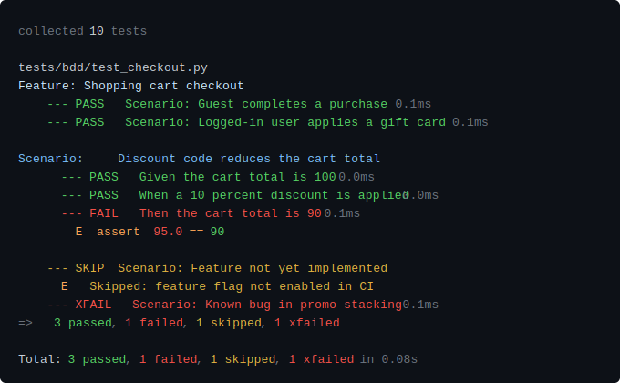
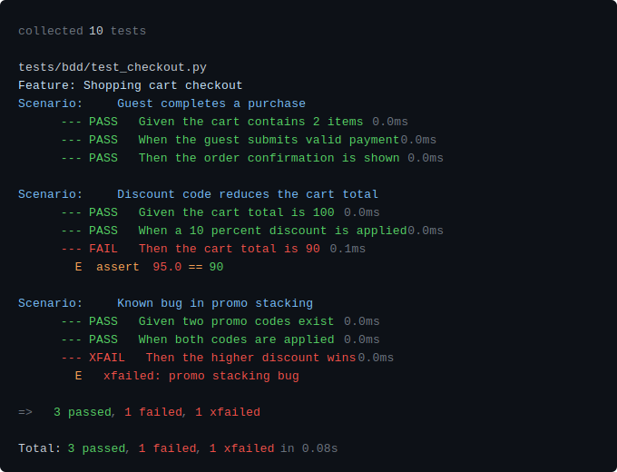

<div align="center">

# 🏺 pytest-glaze

### A thin, transparent coat that makes your test output shine.

[](https://pypi.org/project/pytest-glaze/)
[](https://pypi.org/project/pytest-glaze/)
[](https://docs.pytest.org/)
[](LICENSE)
[](https://github.com/mikejmz24/pytest-glaze)

<br/>


</div>

---

pytest-glaze is a drop-in pytest output formatter that replaces the default
terminal reporter with a compact, color-semantic display. Failures surface
inline — no scrolling to a deferred block — and every color carries a
consistent meaning across every line type.

---

## Why pytest-glaze?

The default pytest reporter is designed for completeness.
pytest-glaze is designed for **reading speed**.
When you are deep in a debugging session the question is always the same:
_what failed, and what exactly was wrong?_

|                               | Default reporter | pytest-rich / pytest-pretty | **pytest-glaze** |
| ----------------------------- | :--------------: | :-------------------------: | :--------------: |
| Failures inline               | ✗ deferred block |           Partial           |        ✓         |
| Consistent color semantics    |        ✗         |           Partial           |        ✓         |
| Zero extra dependencies       |        ✓         |       ✗ Rich required       |        ✓         |
| Compact — one line per result |        ✗         |              ✗              |        ✓         |
| Per-file summaries            |        ✗         |              ✗              |        ✓         |
| BDD-aware (pytest-bdd)        |        ✗         |              ✗              |        ✓         |

<br/>

### Color convention

Every color carries one meaning, applied consistently across every line type:

| Badge | Color        | Meaning                                     | Where you see it                                                         |
| :---: | ------------ | ------------------------------------------- | ------------------------------------------------------------------------ |
|  🟢   | Bright green | Received ✓ / expected value                 | PASS badge, `---`, assert right side, `-` diff, `Expected:` label        |
|  🔴   | Bright red   | Received ✗ / wrong value / expected failure | FAIL · XFAIL badge, `---`, assert left side, `+` diff, `Obtained:` label |
|  🟡   | Yellow       | Skipped / unexpected pass                   | SKIP · XPASS badge, `---`, skip reason                                   |
|  🔴   | Standard red | Collection / setup errors                   | ERROR badge, `---`, collection error messages                            |
|  🍑   | Soft peach   | Context / prose                             | Exception messages, diff context, `E` prefix, operator keywords          |
|  🔅   | Dim          | Metadata                                    | Duration, collection count, `Total:` line                                |

---

## Installation

```bash
pip install pytest-glaze
```

pytest-glaze registers itself automatically — no configuration required.
Install and run.

### Requirements

- **Python** ≥ 3.10
- **pytest** ≥ 7.0

---

## Usage

### Automatic

Once installed, pytest-glaze activates for every `pytest` invocation:

```bash
pytest tests/
```

### Makefile (strongly recommended)

A Makefile gives you precise control: glaze on by default, raw output
available when you need to debug the formatter itself. This is the
recommended setup for any project with a regular test workflow.

```makefile
PYTHON := python
PYTEST := uv run pytest          # or: python -m pytest
TESTS  := tests/

# Core formatter flags
# -p no:terminal    silence the default reporter
# -p pytest_glaze   load our plugin (PYTHONPATH=. makes it importable)
FMT := -p no:terminal -p pytest_glaze

# Optional pass-through filters
SUITE ?=
CASE  ?=
K     ?=
ARGS  ?=

_PATH  := $(if $(SUITE),$(SUITE),$(TESTS))
_KFLAG := $(if $(K),-k "$(K)",$(if $(CASE),-k "$(CASE)",))

.PHONY: test test-fast test-unit test-raw

## test        Run suite with glaze output.
##             SUITE=, CASE=, K= for filtering. ARGS= for raw pytest flags.
##             Examples:
##               make test
##               make test SUITE=tests/test_entities.py
##               make test CASE=test_return_statuses_dict
##               make test K="sprint and not slow"
test:
	@PYTHONPATH=. $(PYTEST) $(FMT) $(_PATH) $(_KFLAG) $(ARGS)

## test-fast   Stop on first failure (-x). Accepts same filters as `test`.
test-fast:
	@PYTHONPATH=. $(PYTEST) $(FMT) -x $(_PATH) $(_KFLAG) $(ARGS)

## test-unit   Unit tests only — clean pass/fail signal, no intentional failures.
test-unit:
	@PYTHONPATH=. $(PYTEST) $(FMT) tests/test_parsers.py tests/test_colorizer.py tests/test_plugin.py $(_KFLAG) $(ARGS)

## test-raw    Raw default pytest output. Useful for debugging the formatter.
test-raw:
	@$(PYTEST) $(_PATH) $(_KFLAG) $(ARGS)

## help        List all targets.
help:
	@grep -E '^##' Makefile | sed 's/^## /  /'
```

### Disable for a single run

```bash
pytest -p no:pytest_glaze tests/
```

---

## What it formats

<details>
<summary><strong>Passing tests</strong></summary>

```
--- PASS  test_user_login                                  0.8ms
--- PASS  test_token_refresh                               1.2ms
```

</details>

<details>
<summary><strong>Failing assertions — inline, never deferred</strong></summary>

```
--- FAIL  test_fail_int_equality                           0.4ms
  E  assert 3 == 30

--- FAIL  test_fail_string                                 0.6ms
  E  AssertionError: assert 'INTGPT-109' == 'INTGPT-1091'
  E  - INTGPT-1091
  E  + INTGPT-109

--- FAIL  test_fail_none_check                             0.3ms
  E  assert None is not None

--- FAIL  test_fail_bool                                   0.3ms
  E  AssertionError: this flag should be True
  E  assert False
```

</details>

<details>
<summary><strong>Dict and list diffs</strong></summary>

```
--- FAIL  test_fail_dict                                   0.6ms
  E  AssertionError: assert {'a': 1, 'b': 2, 'c': 3} == {'a': 1, 'b': 999, 'd': 4}
  E  Differing items:
  E  {'b': 2} != {'b': 999}
  E  Left contains 1 more item:
  E  {'c': 3}

--- FAIL  test_fail_list                                   0.5ms
  E  AssertionError: assert ['Global Launch'] == ['Global Launches']
  E  At index 0 diff: 'Global Launch' != 'Global Launches'
```

</details>

<details>
<summary><strong>Approximate equality (pytest.approx)</strong></summary>

```
--- FAIL  test_fail_approx_abs                             0.2ms
  E  assert 3.141592653589793 == 3.14 ± 0.001
  E  comparison failed
  E  Obtained: 3.141592653589793
  E  Expected: 3.14 ± 0.001

--- FAIL  test_fail_approx_list                            0.2ms
  E  assert [0.3000000000...003] == approx([0.4 ± 1.0e-09])
  E  comparison failed. Mismatched elements: 2 / 2:
  E  Index | Obtained            | Expected
  E  0     | 0.30000000000000004 | 0.4 ± 1.0e-09
  E  1     | 3.3000000000000003  | 3.4 ± 1.0e-09
```

</details>

<details>
<summary><strong>Skips, xfail, and xpass</strong></summary>

```
--- SKIP   test_skip_platform_conditional                  0.2ms
  E  Skipped: Windows-only feature

--- XFAIL  test_xfail_expected_failure                     0.3ms
  E  xfailed: known bug — assert will fail as expected

--- XPASS  test_xpass_unexpected_pass                      0.2ms
  E  xpassed: this test unexpectedly passes
```

XFAIL renders in bright red — an expected failure is still a red signal
worth tracking. XPASS renders in yellow — an unexpected pass is a surprise
worth investigating, but not an error.

</details>

<details>
<summary><strong>Fixture errors</strong></summary>

```
--- PASS   test_error_in_fixture_teardown                  0.2ms
--- ERROR  test_error_in_fixture_teardown                  0.3ms
  E  RuntimeError: Teardown exploded intentionally
```

Setup and teardown errors are classified separately from test failures.
A passing test body followed by a teardown ERROR both appear — neither is
silently swallowed.

</details>

<details>
<summary><strong>Captured output (shown only on failures)</strong></summary>

```
--- FAIL  test_fail_with_stdout_and_stderr                 0.4ms
  E  AssertionError: intentional failure with stdout and stderr
  E  assert False
  ── Captured stdout call ──
  stdout payload for this failure
  ── Captured stderr call ──
  stderr payload for this failure
```

Captured output sections are suppressed on passing tests and rendered
inline on failures — no separate output block to hunt for.

</details>

<details>
<summary><strong>Per-file summaries</strong></summary>

```
tests/test_entities.py
  --- PASS  test_user_create                               0.3ms
  --- FAIL  test_user_update                               0.8ms
    E  assert 'inactive' == 'active'
  --- PASS  test_user_delete                               0.2ms
  => 2 passed, 1 failed

tests/test_auth.py
  --- PASS  test_login                                     0.4ms
  --- PASS  test_logout                                    0.3ms
  => 2 passed

Total: 4 passed, 1 failed  in 0.42s
```

</details>

<details>
<summary><strong>Class-based test grouping</strong></summary>

```
tests/test_parsers.py
TestParseAssert
--- PASS  test_simple_int_equality                     0.1ms
--- PASS  test_simple_float_equality                   0.1ms
--- PASS  test_simple_string_equality                  0.1ms
--- FAIL  test_assert_without_operator_returns_none    0.1ms
E  assert False
TestParseBareAssert
--- PASS  test_false                                   0.1ms
--- PASS  test_none                                    0.2ms
--- PASS  test_variable_name                           0.1ms
=> 6 passed, 1 failed
```

Class names render as section headers. Method names render without the class prefix.
Non-class tests render as before — no header, just the test name.

## </details>

## BDD support (pytest-bdd)

pytest-glaze has first-class support for [pytest-bdd](https://pytest-bdd.readthedocs.io/).
Install pytest-bdd alongside pytest-glaze and BDD scenarios render with
Feature/Scenario headers, per-step results, and the same color semantics
as regular tests.

### Requirements

```bash
pip install pytest-bdd
```

### Compact mode (default)

By default pytest-glaze renders BDD scenarios in compact mode — one line
per scenario. Failures and errors always show full step-by-step output so
you can see exactly where things went wrong.



### Full step-by-step mode (`--bdd-steps`)

Pass `--bdd-steps` to see every step for every scenario:

```bash
pytest --glaze --bdd-steps tests/bdd/
```



### Supported scenario types

pytest-glaze handles every pytest-bdd scenario type:

| Type                              | Rendering                                                 |
| --------------------------------- | --------------------------------------------------------- |
| All steps pass                    | Compact PASS line (default) or full steps (`--bdd-steps`) |
| Failing assertion in Then         | Full steps with colored `assert X == Y` E line            |
| Non-assertion error in When       | Full steps with `ExceptionType: message` E line           |
| Error in Given (setup crash)      | ERROR on the Given step                                   |
| Step not found                    | ERROR on the missing step, trimmed message                |
| Skipped (`@pytest.mark.skip`)     | `--- SKIP  Scenario: …` with reason                       |
| Skipped via Gherkin tag (`@skip`) | Same as above via `pytest_bdd_apply_tag`                  |
| Xfail                             | Last step gets `--- XFAIL` badge                          |
| Xpass                             | Last step gets `--- XPASS` badge                          |
| Background steps                  | Dim `Background:` label before first background step      |
| Scenario Outline                  | One compact/full line per example row                     |
| Multiple example tables           | Each table's rows rendered independently                  |
| Docstring arguments               | Transparent — steps render normally                       |
| Datatable arguments               | Transparent — steps render normally                       |
| Teardown failure                  | `--- ERROR  teardown failed` after the scenario line      |
| Unicode scenario/step names       | Fully supported                                           |
| Tagged scenarios                  | Tags applied as pytest marks, rendering unaffected        |
| Rule blocks                       | Scenarios inside Rules render identically                 |
| Shared steps (conftest)           | Transparent — steps render normally                       |
| Wildcard `*` keyword              | Rendered as continuation step                             |
| Generic `@step` decorator         | Rendered identically to `@given/@when/@then`              |

### Makefile targets for BDD

```makefile
BDD_TESTS := tests/bdd/

FILE     ?=   # scope to a single file:  make test-bdd FILE=test_checkout
SCENARIO ?=   # scope to a scenario:     make test-bdd SCENARIO="Guest completes a purchase"

_BDD_PATH  := $(if $(FILE),tests/bdd/$(FILE).py,$(BDD_TESTS))
_BDD_KFLAG := $(if $(SCENARIO),-k "$(SCENARIO)",)

## test-bdd          Compact BDD output (default).
test-bdd:
	@PYTHONPATH=. $(PYTEST) $(FMT) $(_BDD_PATH) $(_BDD_KFLAG) $(ARGS)

## test-bdd-steps    Full step-by-step BDD output.
test-bdd-steps:
	@PYTHONPATH=. $(PYTEST) $(FMT) --bdd-steps $(_BDD_PATH) $(_BDD_KFLAG) $(ARGS)

## test-bdd-gherkin  Native pytest-bdd Gherkin terminal reporter (-v).
test-bdd-gherkin:
	@PYTHONPATH=. $(PYTEST) --gherkin-terminal-reporter -v $(_BDD_PATH) $(_BDD_KFLAG) $(ARGS)
```

---

## Noise suppression

pytest-glaze automatically suppresses lines that add no value in compact
output — before any line is rendered:

- `Omitting N identical items, use -vv to show`
- `Use -v to get more diff`
- `Full diff:`

The meaningful diff lines remain. The noise does not.

---

## Compatibility

pytest-glaze is a pure formatter with no opinion on how you write your tests.
It works alongside:

- **pytest-cov** — coverage reporting is unaffected
- **pytest-xdist** — parallel runs are supported
- **pytest-bdd** — full BDD-aware rendering (see above)
- **pytest-mock**, **pytest-asyncio**, and any plugin that doesn't replace
  the terminal reporter

> **Note:** Any plugin that also replaces the terminal reporter (e.g.
> `pytest-rich`) will conflict. Use one formatter at a time.

---

## Contributing

pytest-glaze is a personal project. If you find a failure shape the formatter
doesn't handle well, open an issue with the raw `pytest` output and I'll take
a look. Pull requests are welcome.

---

## License

[MIT](LICENSE) © [mikejmz24](https://github.com/mikejmz24)

---

<div align="center">

_pytest-glaze — because your test output deserves a coat of glaze._ 🏺

</div>
